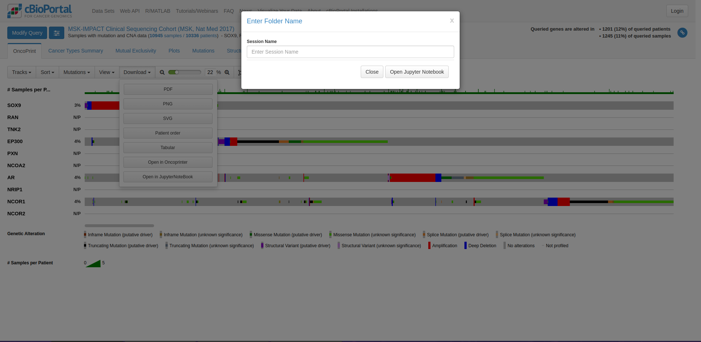

# cBioPortal Integration with JupyterLite

## Overview

This project aims to enhance the functionality of the cBioPortal by integrating it with JupyterLite, a browser-based Jupyter notebook environment. Users of cBioPortal will now be able to directly spawn Jupyter notebook environments from various points within the application, allowing them to perform custom analysis and visualization of the data they have queried or filtered.



## Project Structure

The project consists of two main folders:

1. `package`: This folder contains the code for the cBioPortal extension that facilitates the integration with JupyterLite.
2. `lite`: This folder contains the code for the JupyterLite application that will be spawned from within the cBioPortal.

## Folder Structure and Key Files

### `package` Folder

The `package` folder contains the code for the cBioPortal extension. The main file to focus on is:

- `src/index.ts`: This file contains the code of the extension. First the file gets saved and then as soon as it receives the message from the host (***cBioPortal***), it starts auto-executing the code.

### `lite` Folder

The `lite` folder contains the code for the JupyterLite application. The main file to focus on is:

- `lab/index.html`: This file serves as the entry point for the JupyterLite application and can be used to customize the user interface. **It receives the data from the host.**

## Setup and Installation

### Prerequisites

- Here we use [conda](https://conda.io/projects/conda/en/latest/index.html), a package and environment manager.
- [Node.js](https://nodejs.org/) and npm (Node Package Manager) installed on your system. 

### Installation Steps

1. Create a conda environment:

   ```bash
   conda create -n jupyterlab-iframe-ext --override-channels --strict-channel-priority -c conda-forge -c nodefaults jupyterlab=4 nodejs=20 git copier=7 jinja2-time jupyterlite-core
   conda activate jupyterlab-iframe-ext
   ```

2. Change directory to the `package` folder:

   ```bash
   cd package
   ```

3. Create a `yarn` environment and install all dependencies:

   ```bash
   yarn init -y
   yarn
   ```

4. Finally, install the dependencies and the extension, to add the extension in conda environment.

   ```bash
   pip install -e .
   jupyter labextension develop --overwrite .
   ```

5. **Whenever a new changes are performed**, to sync them with the environment run:

   ```bash
   jlpm run build
   ```

6. For building the JupyterLite application run the below command in root directory:

   ```bash
   cd ..
   jupyter lite build --output-dir lite
   ```

7. To start the development server, run the following command:

   ```bash
   python -m http.server -b 127.0.0.1
   ```

   This will start the JupyterLite application and make it available at `http://127.0.0.1:8000`.
   This will start the cBioPortal extension and integrate it with the JupyterLite application.

## Usage

Once the setup is complete, users will be able to access the JupyterLite integration within the cBioPortal application.

## Customization and Extension

The project is designed to be easily customizable and extensible. You can modify the code in the `package` and `lite` folders to add more features, integrate additional tools, or enhance the overall user experience based on above steps.

## Contribution

If you would like to contribute to this project, please feel free to submit pull requests or open issues on the project's repository.
